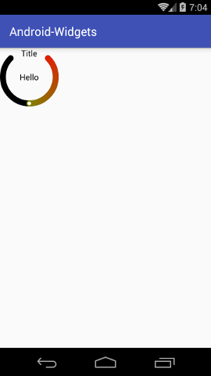

# Android自定义`View`库
工作中很多时候需要去定义一些自己的`View`，把自己的定义的`View`都放在这儿帮助有需要的人,为开源尽一份力。项目是以module为
单位的每个控件都是一个module,app module是项目的启动和演示接口。后期我会慢慢加入更多自己写的库。有需要帮助的同学可以联系
我一起学习交流。

###[我的博客](http://www.cnblogs.com/xwgblog/)
###head_main@qq.com

    
##圆角进度条
在Android中要实现圆角的进度条就必需要去自己去定义了，就算你将`ProgressBar`的进度图片设置成圆角的也是不行的，由于Android内部
实现的是用`ClipDrawable`的不是用拉伸的所以图片的圆角也会被剪掉。
   
###示例
```xml
    <com.lw.widget.roundedprogressbar.RoundedProgressBar
        xmlns:app="http://schemas.android.com/apk/res-auto"
        android:layout_width="match_parent"
        android:layout_height="wrap_content"
        android:minHeight="10dp"
        android:max="100"
        android:progress="50"
        app:colorBackground="#FF000000"
        app:colorProgress="#FFFF0000"
        />
```
###效果图

   

##圆形背景布局
实现一个半圆的进度条，基本的需求是画一个半圆的进度条上面有一个标题，中间有一段小文字，我的实现的方法是新建的`CircleLayout`继承`FrameLayout`,
设置`setWillNotDraw`方法为`FALSE`然后实现`onDraw`方法画出圆，文字什么的就在布局中解决就好了。

####`Note: 目前只支持设定固定宽和高。`

###示例
```xml
   <com.lw.widget.circlelayout.CircleLayout
        xmlns:app="http://schemas.android.com/apk/res-auto"
        android:id="@+id/circle_layout"
        android:layout_width="100dp"
        android:layout_height="100dp"
        app:startColor="#FFFF0000"
        app:endColor="#FF00FF00"
        app:strokeWidth="10dp"
        app:startSweepAngle="45"
        app:endSweepAngle="315"
        app:pointColor="#FFFFFFFF"
        app:progress="0.5"
        app:circleBackground="#FF000000"
        android:paddingLeft="10dp"
        android:paddingRight="10dp"
        >

        <TextView
            android:id="@+id/tv_circle_title"
            android:layout_width="wrap_content"
            android:layout_height="wrap_content"
            android:text="Title"
            android:layout_gravity="center_horizontal"
            android:textColor="#FF000000"
            />

        <TextView
            android:id="@+id/tv_circle_progress"
            android:layout_width="wrap_content"
            android:layout_height="wrap_content"
            android:layout_gravity="center"
            android:text="Hello"
            android:textColor="#FF000000"
            />
    </com.lw.widget.circlelayout.CircleLayout>
```

###效果图
