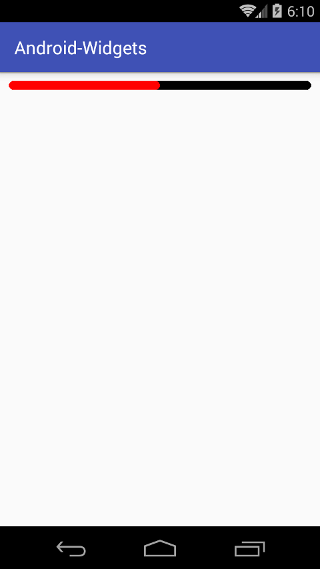

# Android自定义`View`库
工作中很多时候需要去定义一些自己的`View`，把自己的定义的`View`都放在这儿帮助有需要的人,为开源尽一份力。项目是以module为
单位的每个控件都是一个module,app module是项目的启动和演示接口。后期我会慢慢加入更多自己写的库。有需要帮助的同学可以联系
我一起学习交流。

###[我的博客](http://www.cnblogs.com/xwgblog/)
###Email:head_main@qq.com

    
##圆角进度条
在Android中要实现圆角的进度条就必需要去自己去定义了，就算你将ProgressBar的进度图片设置成圆角的也是不行的，由于Android内部
实现的是用ClipDrawable的不是用拉伸的所以图片的圆角也会被剪掉。
   
###示例
```xml
    <com.lw.widget.RoundedProgressBar
        xmlns:app="http://schemas.android.com/apk/res-auto"
        android:layout_width="match_parent"
        android:layout_height="wrap_content"
        android:minHeight="10dp"
        android:max="100"
        android:progress="50"
        app:colorBackground="#FF000000"
        app:colorProgress="#FFFF0000"
        />
```
###效果图

   
